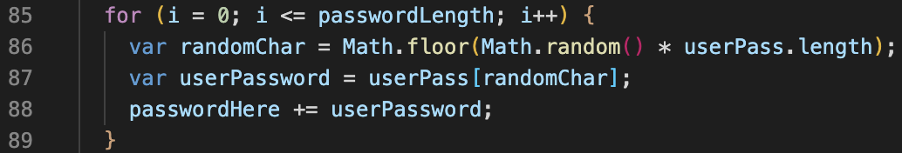
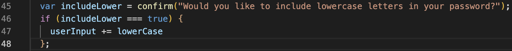

# Password-Generator

## Description

I have created a random password generator webpage. When a user visits this page, there is a button to click to generate a password. Once clicked, they are prompted with a serious of questions to create the password. First they are asked to select a length between 8-128. Then they are asked four questions which include; Would you like to use lowercase letters, would you like to include uppercase letters, would you like to include numbers, and would you like to include special characters?

I was motivated to build this webpage to help make passwords for the numerous logins that I have. By using this site, it helps create a more secure password that can not be simply identified. Building this helped me learn many different features within javascript. A great example of this is shown in the screenshot below using a "for" function.

Another feature that I used was prompt's as well as booleans. The prompt to ask questions. Booleans to check how the user responded.

## Usage

To use this site, simply visit the webpage. Then click the "Generate Password" button to bring about the prompts asking you the required items for the password.

You can view and you this web application here:

https://tylerdins88.github.io/password-generator/

## License

This feature a MIT License.

The following programming languages were used in the creation of this page.

HTML CSS Javascript