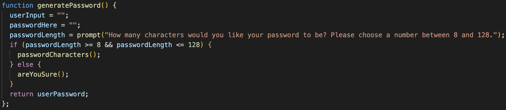
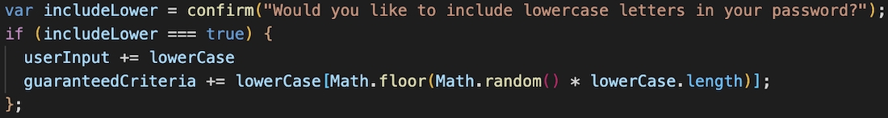
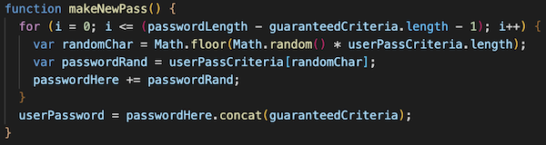

# Password-Generator

## Description

I have created a random password generator webpage. When a user visits this page, there is a button to click to generate a password. Once clicked, they are prompted with a serious of questions to create the password. First they are asked to select a length between 8-128. Then they are asked four questions which include; Would you like to use lowercase letters, would you like to include uppercase letters, would you like to include numbers, and would you like to include special characters?

I was motivated to build this webpage to help make passwords for the numerous logins that I have. By using this site, it helps create a more secure password that can not be simply identified. Building this helped me learn many different features within javascript. 

First I created a function, that when the user presses the Generate Password button, starts the process. This asks the user how many characters they would like the password to be. 

Next I used a confirm method to ask what criteria the user would like to include in the password.

Then I created a for loop to make the password using the amount of characters a user chose as well as the criteria that they wished for the password to include. This also makes sure to include the guaranteed criteria selected.

## Usage

To use this site, simply visit the webpage. Then click the "Generate Password" button to bring about the prompts asking you the required items for the password.

You can view and you this web application here:

https://tylerdins88.github.io/password-generator/

## License

This feature a MIT License.

The following programming languages were used in the creation of this page.

HTML CSS Javascript